# Master Project Architecture Canvas

One Mermaid canvas containing the architecture of each documented project in this workspace. Each project is kept in its own box so you can browse them in one place without turning the whole file into a fake cross-project system diagram.

Undocumented folders are grouped separately as `No Architecture Yet`.

```mermaid
%%{init: {
  "theme": "base",
  "themeVariables": {
    "background": "#ffffff",
    "lineColor": "#475569",
    "clusterBkg": "#f8fafc",
    "clusterBorder": "#94a3b8",
    "fontFamily": "Helvetica, Arial, sans-serif"
  }
}}%%
flowchart TB
    Canvas["Master Project Architecture Canvas<br/>Each box is one project's internal architecture"]:::hub

    subgraph Personal["personal/"]
        direction TB
        PMark["personal documented architectures"]:::space

        subgraph PSecurity["Security + NetOps"]
            direction TB

            subgraph PZephron["zephron"]
                direction LR
                ze1["Customer + MSP portals"]
                ze2["FastAPI backend<br/>auth / API / alerts / incidents"]
                ze3["LangGraph agents"]
                ze4["MCP server portfolio"]
                ze5["Network / cloud / SaaS targets"]
                ze6["Zabbix + observability"]
                ze1 --> ze2 --> ze3 --> ze4 --> ze5
                ze6 --> ze2
            end

            subgraph PZscaler["zscaler-mcp"]
                direction LR
                zs1["MCP clients"]
                zs2["Transport<br/>HTTP / SSE / stdio"]
                zs3["FastMCP protocol layer"]
                zs4["Service dispatch"]
                zs5["Zscaler Python SDK"]
                zs6["Zscaler APIs"]
                zs1 --> zs2 --> zs3 --> zs4 --> zs5 --> zs6
            end

            subgraph PNetSecSkills["netsec-skills"]
                direction LR
                ns1["OpenClaw / user interfaces"]
                ns2["Core agent layer"]
                ns3["SKILL.md library"]
                ns4["MCP bridge"]
                ns5["MCP servers"]
                ns6["External platforms"]
                ns1 --> ns2 --> ns3 --> ns4 --> ns5 --> ns6
            end

            subgraph PNetworkMCPs["network-mcps"]
                direction LR
                nm1["LLM agent"]
                nm2["MCP protocol"]
                nm3["FastMCP server"]
                nm4["Tool functions"]
                nm5["Vendor SDKs"]
                nm6["Vendor REST APIs"]
                nm7["Read-only + gated writes"]
                nm1 --> nm2 --> nm3 --> nm4 --> nm5 --> nm6
                nm7 --> nm3
            end

            subgraph PPolicyFoundry["policyfoundry"]
                direction LR
                pf1["Traffic log sources"]
                pf2["Parsers + normalizer"]
                pf3["Storage layer"]
                pf4["LangGraph pipeline<br/>analyze / assess / generate / decide"]
                pf5["Human approval gate"]
                pf6["Firewall adapters"]
                pf1 --> pf2 --> pf3 --> pf4 --> pf5 --> pf6
            end

            subgraph P0xpwn["0xpwn"]
                direction LR
                xp1["CLI / TUI / REST / CI"]
                xp2["Agent core<br/>planner / executor / validator"]
                xp3["LiteLLM layer"]
                xp4["Docker tool sandboxes"]
                xp5["Targets under test"]
                xp6["State + reporting"]
                xp1 --> xp2
                xp2 --> xp3
                xp2 --> xp4 --> xp5
                xp2 --> xp6
            end

            subgraph PCyberResearch["cyber-tools-research"]
                direction LR
                cy1["Problem data catalog"]
                cy2["State + tier filters"]
                cy3["Card list"]
                cy4["Detail panel"]
                cy5["Bubble / bar / radar visuals"]
                cy1 --> cy2 --> cy3 --> cy4
                cy2 --> cy5
            end
        end

        subgraph POps["Agent Ops + Infra"]
            direction TB

            subgraph PLumon["lumon"]
                direction LR
                lu1["Browser UI + xterm.js"]
                lu2["Tailscale Serve"]
                lu3["Node API + WS + orchestrator"]
                lu4["SQLite + GSD files + worktrees"]
                lu5["tmux + agent runtime"]
                lu1 --> lu2 --> lu3 --> lu4 --> lu5
                lu5 --> lu3
            end

            subgraph PVPS["vps-automator"]
                direction LR
                vp1["Mac access"]
                vp2["Tailscale-only network"]
                vp3["Ubuntu host + UFW"]
                vp4["Coolify infra layer"]
                vp5["Mission Control / Paperclip / Ollama"]
                vp6["tmux agents + OpenClaw"]
                vp1 --> vp2 --> vp3 --> vp4 --> vp5 --> vp6
            end
        end

        subgraph PTrading["Trading + Finance"]
            direction TB

            subgraph PStrat["strat-trading"]
                direction LR
                st1["Market + macro data"]
                st2["APScheduler ETL"]
                st3["Storage + cache"]
                st4["AI analysis engine"]
                st5["Signal scoring"]
                st6["Risk management"]
                st7["Execution + monitoring"]
                st1 --> st2 --> st3 --> st4 --> st5 --> st6 --> st7
                st7 --> st4
            end

            subgraph PIntraday["intraday-trading"]
                direction LR
                it1["Market data"]
                it2["Pre-market scanner"]
                it3["Trading bot lifecycle"]
                it4["ORB / VWAP / RSI engine"]
                it5["Risk gate"]
                it6["Alpaca execution + safety net"]
                it1 --> it2 --> it3 --> it4 --> it5 --> it6
            end
        end

        subgraph PProducts["Products + Marketplaces"]
            direction TB

            subgraph PAIBazar["ai-bazar"]
                direction LR
                ab1["Buyer / seller / admin / mobile"]
                ab2["Gateway + auth + realtime"]
                ab3["Core marketplace services"]
                ab4["AI due diligence engine"]
                ab5["Acqui-hire module"]
                ab6["Data + infra"]
                ab1 --> ab2 --> ab3
                ab3 --> ab4
                ab3 --> ab5
                ab3 --> ab6
                ab4 --> ab6
                ab5 --> ab6
            end
        end

        subgraph PNoArch["No Architecture Yet"]
            direction LR
            ppoly["polyagents"]:::placeholder
            pwheel["wheel-screener"]:::placeholder
            pwheellly["wheellly"]:::placeholder
            pcar["car"]:::placeholder
        end
    end

    subgraph TwinCoast["twincoastlabs/"]
        direction TB
        TMark["twincoastlabs documented architectures"]:::space

        subgraph TProducts["Products"]
            direction TB

            subgraph TEchelon["aiagency / Echelon"]
                direction LR
                ec1["Client apps"]
                ec2["Gateway + auth"]
                ec3["Paperclip fork control plane"]
                ec4["LangGraph + CrewAI agents"]
                ec5["LiteLLM + RouteLLM"]
                ec6["Letta + pgvector + Haystack"]
                ec7["MCP + n8n + Stripe + LangSmith"]
                ec1 --> ec2 --> ec3 --> ec4
                ec4 --> ec5
                ec4 --> ec6
                ec4 --> ec7
            end

            subgraph TInkPulse["InkPulse"]
                direction LR
                ip1["proxy.ts cookie refresh"]
                ip2["Next.js App Router"]
                ip3["Supabase auth + tenant guard"]
                ip4["Drizzle + RLS data layer"]
                ip5["Booking / consent / subscription logic"]
                ip6["Stripe Connect + Billing"]
                ip1 --> ip2 --> ip3 --> ip4 --> ip5 --> ip6
            end
        end

        subgraph TNoArch["No Architecture Yet"]
            direction LR
            tcrew["crewnook"]:::placeholder
        end
    end

    Canvas --> PMark
    Canvas --> TMark

    classDef hub fill:#0f172a,stroke:#0f172a,color:#f8fafc,stroke-width:2px;
    classDef space fill:#dbeafe,stroke:#2563eb,color:#1e3a8a,stroke-width:1.5px;
    classDef placeholder fill:#f8fafc,stroke:#94a3b8,color:#475569,stroke-dasharray: 3 3;
```

