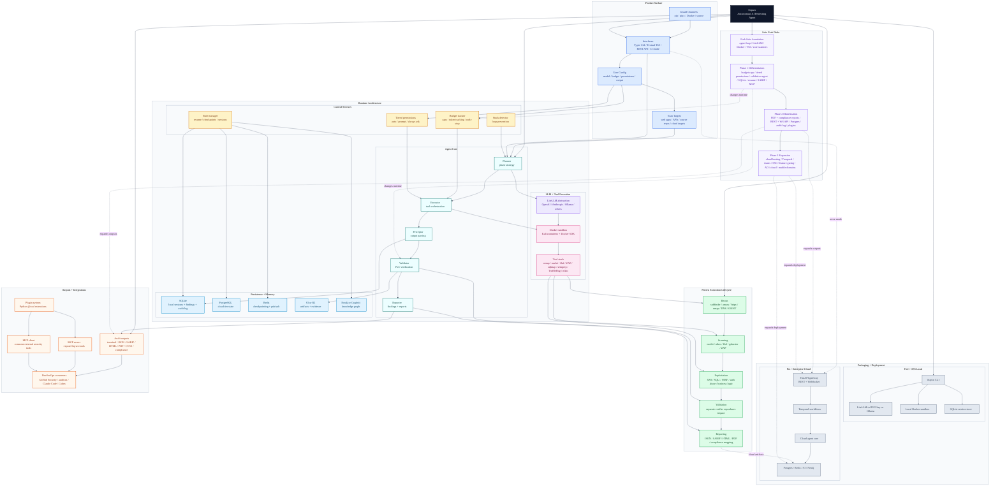

# 0xpwn Master Architecture

Consolidated Mermaid diagram for the entire `personal/0xpwn` folder.

Sources used:
- `0xpwn-spec.jsx`
- `0xpwn-brand-kit.jsx`
- `strix-gap-analysis.jsx`

```mermaid
---
id: 53aec9ba-e55c-43a1-8228-86f81bff9d82
---

%%{init: {
  "theme": "base",
  "themeVariables": {
    "background": "#ffffff",
    "lineColor": "#475569",
    "clusterBkg": "#f8fafc",
    "clusterBorder": "#94a3b8",
    "fontFamily": "Helvetica, Arial, sans-serif"
  }
}}%%
flowchart TB
    OXP["0xpwn<br/>Autonomous AI Pentesting Agent"]:::hub

    subgraph Product["Product Surface"]
        direction LR
        Install["Install Channels<br/>pip / pipx / Docker / source"]:::surface
        UI["Interfaces<br/>Typer CLI / Textual TUI / REST API / CI mode"]:::surface
        Config["User Config<br/>model / budget / permissions / output"]:::surface
        Targets["Scan Targets<br/>web apps / APIs / source repos / cloud targets"]:::surface
        Install --> UI --> Config --> Targets
    end

    subgraph Runtime["Runtime Architecture"]
        direction TB

        subgraph Core["Agent Core"]
            direction LR
            Planner["Planner<br/>phase strategy"]:::core
            Executor["Executor<br/>tool orchestration"]:::core
            Perceptor["Perceptor<br/>output parsing"]:::core
            Validator["Validator<br/>PoC verification"]:::core
            Reporter["Reporter<br/>findings + reports"]:::core
            Planner --> Executor --> Perceptor --> Validator --> Reporter
        end

        subgraph Controls["Control Services"]
            direction LR
            Budget["Budget tracker<br/>caps / token tracking / early stop"]:::control
            Permissions["Tiered permissions<br/>auto / prompt / always ask"]:::control
            StateMgr["State manager<br/>resume / checkpoints / sessions"]:::control
            Stuck["Stuck detector<br/>loop prevention"]:::control
        end

        subgraph Intelligence["LLM + Tool Execution"]
            direction LR
            LiteLLM["LiteLLM abstraction<br/>OpenAI / Anthropic / Ollama / others"]:::llm
            Sandbox["Docker sandbox<br/>Kali containers + Docker SDK"]:::sandbox
            Toolset["Tool stack<br/>nmap / nuclei / ffuf / ZAP / sqlmap / semgrep / TruffleHog / nikto"]:::sandbox
            LiteLLM --> Sandbox --> Toolset
        end

        subgraph Data["Persistence + Memory"]
            direction LR
            SQLite["SQLite<br/>local sessions + findings + audit log"]:::data
            Postgres["PostgreSQL<br/>cloud tier state"]:::data
            Redis["Redis<br/>checkpointing + pub/sub"]:::data
            ObjectStore["S3 or R2<br/>artifacts + evidence"]:::data
            Graph["Neo4j or Graphiti<br/>knowledge graph"]:::data
        end
    end

    subgraph Pentest["Pentest Execution Lifecycle"]
        direction LR
        Recon["Recon<br/>subfinder / amass / httpx / nmap / DNS / OSINT"]:::phase
        Scanning["Scanning<br/>nuclei / nikto / ffuf / gobuster / ZAP"]:::phase
        Exploit["Exploitation<br/>XSS / SQLi / SSRF / auth abuse / business logic"]:::phase
        Verify["Validation<br/>separate verifier reproduces impact"]:::phase
        Report["Reporting<br/>JSON / SARIF / HTML / PDF / compliance mapping"]:::phase
        Recon --> Scanning --> Exploit --> Verify --> Report
    end

    subgraph Packaging["Packaging + Deployment"]
        direction LR

        subgraph Local["Free / OSS Local"]
            direction TB
            LocalCLI["0xpwn CLI"]:::deploy
            LocalLLM["LiteLLM to BYO key or Ollama"]:::deploy
            LocalDocker["Local Docker sandbox"]:::deploy
            LocalDB["SQLite session store"]:::deploy
            LocalCLI --> LocalLLM
            LocalCLI --> LocalDocker
            LocalCLI --> LocalDB
        end

        subgraph Cloud["Pro / Enterprise Cloud"]
            direction TB
            Gateway["FastAPI gateway<br/>REST + WebSocket"]:::deploy
            Temporal["Temporal workflows"]:::deploy
            CloudAgent["Cloud agent core"]:::deploy
            CloudState["Postgres / Redis / S3 / Neo4j"]:::deploy
            Gateway --> Temporal --> CloudAgent --> CloudState
        end
    end

    subgraph Integrations["Outputs + Integrations"]
        direction LR
        Reports["Audit outputs<br/>terminal / JSON / SARIF / HTML / PDF / CVSS / compliance"]:::output
        MCPServer["MCP server<br/>expose 0xpwn tools"]:::output
        MCPClient["MCP client<br/>consume external security tools"]:::output
        Plugins["Plugin system<br/>Python @tool extensions"]:::output
        Targets2["DevSecOps consumers<br/>GitHub Security / auditors / Claude Code / Codex"]:::output
        Reports --> Targets2
        MCPServer --> Targets2
        MCPClient --> Targets2
        Plugins --> MCPServer
        Plugins --> MCPClient
    end

    subgraph Roadmap["Strix Fork Delta"]
        direction TB
        Base["Fork Strix foundation<br/>agent loop / LiteLLM / Docker / TUI / core scanners"]:::roadmap
        Phase1["Phase 1 Differentiators<br/>budget caps / tiered permissions / validation agent / SQLite / resume / SARIF / MCP"]:::roadmap
        Phase2["Phase 2 Monetization<br/>PDF + compliance reports / REST + WS API / Postgres / audit log / plugins"]:::roadmap
        Phase3["Phase 3 Expansion<br/>cloud hosting / Temporal / teams / SSO / feature gating / AD / cloud / mobile domains"]:::roadmap
        Base --> Phase1 --> Phase2 --> Phase3
    end

    OXP --> UI
    OXP --> Planner
    OXP --> Recon
    OXP --> LocalCLI
    OXP --> Reports
    OXP --> Base

    Targets --> Planner
    Config --> Budget
    Config --> Permissions
    UI --> Planner

    Planner --> LiteLLM
    Executor --> Sandbox
    Perceptor --> SQLite
    Validator --> ObjectStore
    Reporter --> Reports

    Budget --> Executor
    Permissions --> Executor
    StateMgr --> SQLite
    StateMgr --> Postgres
    StateMgr --> Redis
    StateMgr --> Graph
    Stuck --> Planner

    Toolset --> Recon
    Toolset --> Scanning
    Toolset --> Exploit
    Validator --> Verify
    Reporter --> Report

    UI -. serve mode .-> Gateway
    Report -. cloud artifacts .-> CloudState
    Phase1 -. changes runtime .-> Budget
    Phase1 -. changes runtime .-> Validator
    Phase2 -. expands outputs .-> Reports
    Phase2 -. expands outputs .-> Gateway
    Phase3 -. expands deployment .-> Gateway
    Phase3 -. expands deployment .-> CloudState

    classDef hub fill:#0f172a,stroke:#0f172a,color:#f8fafc,stroke-width:2px;
    classDef surface fill:#dbeafe,stroke:#2563eb,color:#1e3a8a,stroke-width:1.5px;
    classDef core fill:#ecfeff,stroke:#0f766e,color:#134e4a,stroke-width:1.5px;
    classDef control fill:#fef3c7,stroke:#d97706,color:#78350f,stroke-width:1.5px;
    classDef llm fill:#ede9fe,stroke:#7c3aed,color:#4c1d95,stroke-width:1.5px;
    classDef sandbox fill:#fce7f3,stroke:#db2777,color:#831843,stroke-width:1.5px;
    classDef data fill:#e0f2fe,stroke:#0284c7,color:#0c4a6e,stroke-width:1.5px;
    classDef phase fill:#dcfce7,stroke:#16a34a,color:#14532d,stroke-width:1.5px;
    classDef deploy fill:#e2e8f0,stroke:#64748b,color:#334155,stroke-width:1.5px;
    classDef output fill:#fff7ed,stroke:#ea580c,color:#9a3412,stroke-width:1.5px;
    classDef roadmap fill:#f5f3ff,stroke:#8b5cf6,color:#5b21b6,stroke-width:1.5px;
```
