# Lumon Master Architecture

Consolidated Mermaid diagram for the entire `personal/lumon` folder.

Sources used:
- `ARCHITECTURE.md`
- `ARCHITECTURE 2.md`
- `compass_artifact_wf-49827d02-3ab3-4911-a226-1f9b7a199998_text_markdown.md`

```mermaid
%%{init: {
  "theme": "base",
  "themeVariables": {
    "background": "#ffffff",
    "lineColor": "#475569",
    "clusterBkg": "#f8fafc",
    "clusterBorder": "#94a3b8",
    "fontFamily": "Helvetica, Arial, sans-serif"
  }
}}%%
flowchart TB
    MC["Mission Control<br/>AI Coding Agent Orchestration Dashboard"]:::hub

    subgraph Browser["Browser Layer"]
        direction LR
        UI["React dashboard"]:::ui
        Terminals["xterm.js terminals"]:::ui
        Status["Agent status cards"]:::ui
        Projects["Project overview"]:::ui
        Plans["GSD planning viewer"]:::ui
        Timeline["Wave timeline"]:::ui
    end

    subgraph Access["Remote Access + Identity"]
        direction LR
        Tailscale["Tailscale Serve<br/>auto HTTPS / MagicDNS"]:::access
        Headers["Identity headers<br/>login / name / avatar"]:::access
        WSAuth["WS auth via first message<br/>not query params"]:::access
        ACL["Tailnet ACLs"]:::access
        Tailscale --> Headers
        Tailscale --> WSAuth
        Tailscale --> ACL
    end

    subgraph Server["Server Layer"]
        direction TB

        subgraph APIs["API + Transport"]
            direction LR
            HTTP["Custom Node.js HTTP server"]:::server
            REST["REST API<br/>projects / agents / gsd / system / hooks"]:::server
            WS["WebSocket server<br/>rooms for terminals / status / events"]:::server
            HTTP --> REST
            HTTP --> WS
        end

        subgraph Orchestrator["Orchestration Engine"]
            direction LR
            Engine["Project state machine"]:::orchestrator
            Wave["Wave scheduler"]:::orchestrator
            Lifecycle["Agent lifecycle manager<br/>spawn / monitor / retry / complete"]:::orchestrator
            Health["Health monitor<br/>list-panes polling + pane-died hooks"]:::orchestrator
            Engine --> Wave --> Lifecycle --> Health
        end

        subgraph Bridges["Bridge Layer"]
            direction LR
            TmuxBridge["tmux bridge<br/>single tmux -CC control connection"]:::bridge
            GSD["GSD bridge<br/>gsd-tools.cjs + .planning parser"]:::bridge
        end
    end

    subgraph Data["Data Layer"]
        direction LR
        SQLite["SQLite<br/>projects / agents / events / costs"]:::data
        Planning[".planning filesystem<br/>PROJECT / ROADMAP / PLAN / CONTEXT / RESEARCH"]:::data
        Worktrees["Git worktrees<br/>one worktree per agent"]:::data
    end

    subgraph Runtime["Runtime Layer"]
        direction LR
        Tmux["tmux server"]:::runtime
        Claude["Claude Code sessions"]:::runtime
        Codex["Codex CLI sessions"]:::runtime
        Sessions["mc-a001 / mc-a002 / ..."]:::runtime
        Tmux --> Sessions
        Sessions --> Claude
        Sessions --> Codex
    end

    subgraph Protocols["Live Protocols"]
        direction LR
        CCOut["tmux %output events"]:::proto
        PaneHook["pane-died hook"]:::proto
        TerminalRoom["terminal:<pane-id> rooms"]:::proto
        WSMsgs["WS messages<br/>terminal:output / agent:status / wave:*"]:::proto
        RESTCmds["REST commands<br/>spawn / stop / retry / send / advance"]:::proto
    end

    subgraph Security["Security + Isolation"]
        direction LR
        LocalTrust["Local-first trust model"]:::security
        WorktreeIso["Filesystem isolation via worktrees"]:::security
        TmuxIso["Per-agent tmux isolation"]:::security
        NoSecrets["No secrets in SQLite"]:::security
        Modes["Sandboxing modes<br/>restricted / autonomous / custom"]:::security
    end

    subgraph Scale["Future Scaling Path"]
        direction LR
        MultiMachine["Remote tmux over SSH"]:::future
        PG["PostgreSQL replacement"]:::future
        Redis["Redis pubsub for WS"]:::future
        CloudAgents["Cloud-hosted agents<br/>Codex App Server"]:::future
    end

    MC --> UI
    MC --> Tailscale
    MC --> HTTP
    MC --> SQLite
    MC --> Tmux

    UI --> REST
    Terminals --> WS
    Status --> WS
    Projects --> REST
    Plans --> REST
    Timeline --> WS

    Headers --> HTTP
    WSAuth --> WS

    REST --> Engine
    REST --> GSD
    REST --> SQLite
    WS --> TmuxBridge
    WS --> SQLite

    GSD --> Planning
    Engine --> GSD
    Engine --> Wave
    Wave --> Lifecycle
    Lifecycle --> Worktrees
    Lifecycle --> SQLite
    Lifecycle --> TmuxBridge
    Health --> SQLite
    Health --> WS

    Worktrees --> Tmux
    TmuxBridge --> Tmux
    Tmux --> CCOut
    Tmux --> PaneHook
    CCOut --> TmuxBridge
    PaneHook --> REST
    TmuxBridge --> TerminalRoom
    TerminalRoom --> WSMsgs
    WSMsgs --> WS
    RESTCmds --> REST

    SQLite --> Status
    SQLite --> Projects
    SQLite --> Timeline
    Planning --> Plans

    Tmux --> Sessions
    Sessions --> TerminalRoom

    UI -. spawn project .-> REST
    REST -. parse waves .-> GSD
    GSD -. read plan metadata .-> Planning
    Lifecycle -. create worktree .-> Worktrees
    Lifecycle -. create session .-> Tmux
    Lifecycle -. register agent .-> SQLite
    Lifecycle -. emit event .-> WS

    LocalTrust --> Tailscale
    WorktreeIso --> Worktrees
    TmuxIso --> Sessions
    NoSecrets --> SQLite
    Modes --> Lifecycle

    SQLite -. future replace .-> PG
    WS -. future fanout .-> Redis
    Tmux -. future distribute .-> MultiMachine
    Lifecycle -. future spawn path .-> CloudAgents

    classDef hub fill:#0f172a,stroke:#0f172a,color:#f8fafc,stroke-width:2px;
    classDef ui fill:#dbeafe,stroke:#2563eb,color:#1e3a8a,stroke-width:1.5px;
    classDef access fill:#ede9fe,stroke:#7c3aed,color:#4c1d95,stroke-width:1.5px;
    classDef server fill:#dcfce7,stroke:#16a34a,color:#14532d,stroke-width:1.5px;
    classDef orchestrator fill:#fef3c7,stroke:#d97706,color:#78350f,stroke-width:1.5px;
    classDef bridge fill:#fce7f3,stroke:#db2777,color:#831843,stroke-width:1.5px;
    classDef data fill:#e0f2fe,stroke:#0284c7,color:#0c4a6e,stroke-width:1.5px;
    classDef runtime fill:#fff7ed,stroke:#ea580c,color:#9a3412,stroke-width:1.5px;
    classDef proto fill:#f8fafc,stroke:#64748b,color:#334155,stroke-width:1.5px;
    classDef security fill:#fee2e2,stroke:#dc2626,color:#7f1d1d,stroke-width:1.5px;
    classDef future fill:#f5f3ff,stroke:#8b5cf6,color:#5b21b6,stroke-width:1.5px;
```

