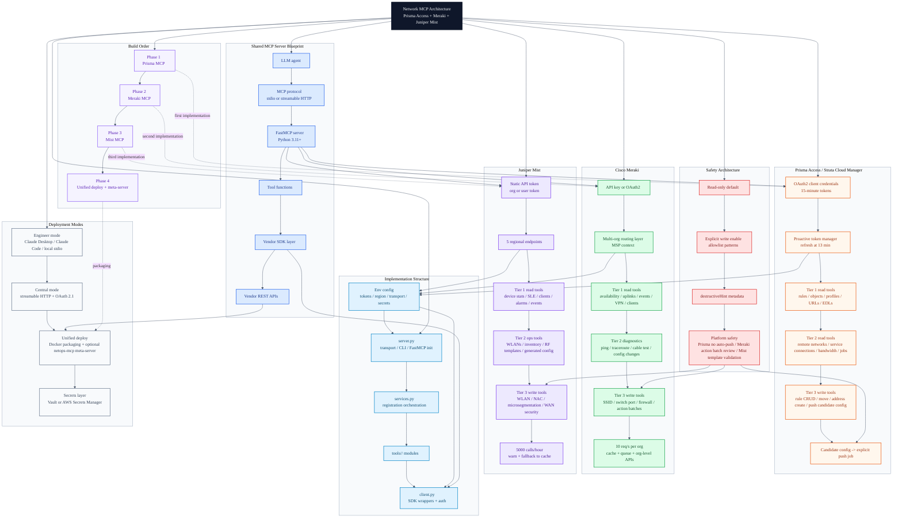

# Network MCPs Master Architecture

Consolidated Mermaid diagram for the entire `personal/network-mcps` folder.

Sources used:
- `mcp-architecture-dashboard.jsx`
- `compass_artifact_wf-e3bd9ed4-c76c-468a-90cb-d75762429fe5_text_markdown.md`

