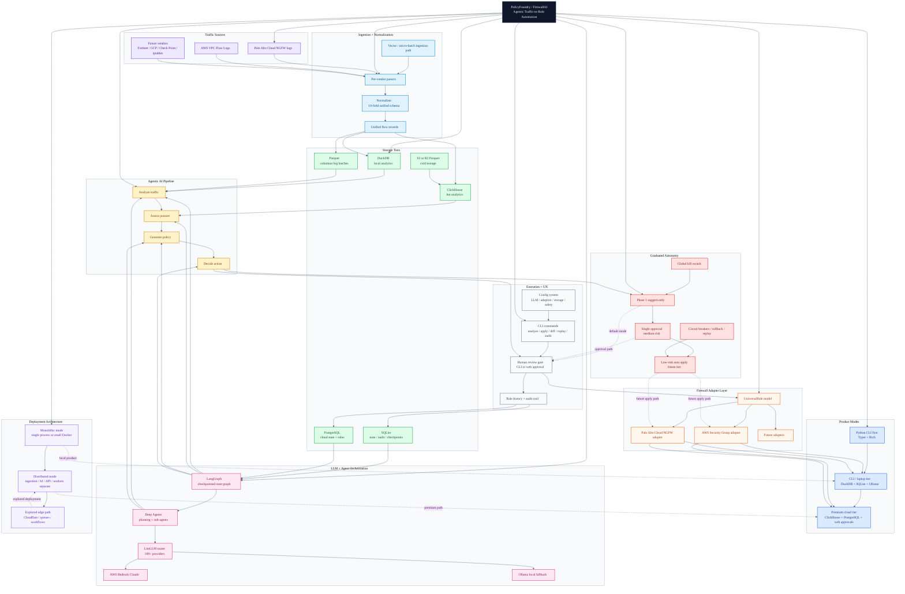

# PolicyFoundry Master Architecture

Consolidated Mermaid diagram for the entire `personal/policyfoundry` folder.

Sources used:
- `01-architecture-plan.md`
- `architecture-dashboard.jsx`
- `compass_artifact_wf-984fdb27-0934-4f7e-b9c1-c2731b575ee6_text_markdown.md`

