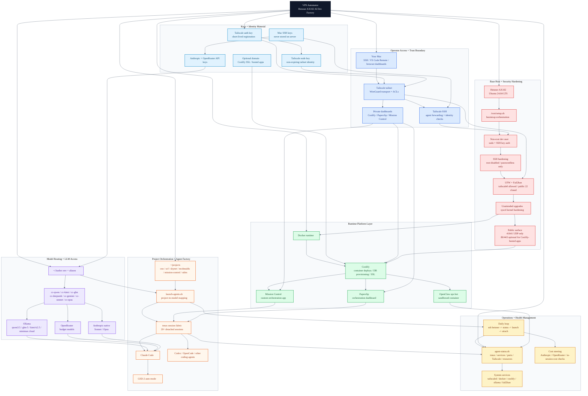

# VPS Automator Master Architecture

Consolidated Mermaid diagram for the entire `personal/vps-automator` folder.

Sources used:
- `hetzner-ax102-complete-setup.md`

```mermaid
---
id: 078a4903-497d-4752-a175-352063291c6c
---
%%{init: {
  "theme": "base",
  "themeVariables": {
    "background": "#ffffff",
    "lineColor": "#475569",
    "clusterBkg": "#f8fafc",
    "clusterBorder": "#94a3b8",
    "fontFamily": "Helvetica, Arial, sans-serif"
  }
}}%%
flowchart TB
    VPS["VPS Automator<br/>Hetzner AX102 AI Dev Factory"]:::hub

    subgraph Access["Operator Access + Trust Boundary"]
        direction LR
        Mac["Your Mac<br/>SSH / VS Code Remote / browser dashboards"]:::access
        Tailnet["Tailscale tailnet<br/>WireGuard transport + ACLs"]:::access
        SSH["Tailscale SSH<br/>agent forwarding + identity checks"]:::access
        Dash["Private dashboards<br/>Coolify / Paperclip / Mission Control"]:::access
        Mac --> Tailnet --> SSH
        Tailnet --> Dash
    end

    subgraph Hardening["Base Host + Security Hardening"]
        direction LR
        Hetzner["Hetzner AX102<br/>Ubuntu 24.04 LTS"]:::host
        Setup["/root/setup.sh<br/>bootstrap orchestration"]:::host
        User["Non-root dev user<br/>sudo + SSH key auth"]:::host
        SSHConf["SSH hardening<br/>root disabled / passwordless only"]:::host
        Firewall["UFW + Fail2ban<br/>tailscale0 allowed / public 22 closed"]:::host
        Updates["Unattended upgrades<br/>sysctl kernel hardening"]:::host
        PublicPorts["Public surface<br/>41641 UDP only<br/>80/443 optional for Coolify-hosted apps"]:::host
        Hetzner --> Setup --> User --> SSHConf --> Firewall --> Updates --> PublicPorts
    end

    subgraph Platform["Runtime Platform Layer"]
        direction LR
        Docker["Docker runtime"]:::platform
        Coolify["Coolify<br/>container deploys / DB provisioning / SSL"]:::platform
        Paperclip["Paperclip<br/>orchestration dashboard"]:::platform
        Mission["Mission Control<br/>custom orchestration app"]:::platform
        OpenClaw["OpenClaw ops bot<br/>sandboxed container"]:::platform
        Docker --> Coolify
        Coolify --> Paperclip
        Coolify --> Mission
        Coolify --> OpenClaw
    end

    subgraph Models["Model Routing + LLM Access"]
        direction LR
        Bashrc["~/.bashrc env + aliases"]:::model
        Ollama["Ollama<br/>qwen3.5 / glm-5 / kimi-k2.5 / minimax cloud"]:::model
        OpenRouter["OpenRouter<br/>budget models"]:::model
        Anthropic["Anthropic native<br/>Sonnet / Opus"]:::model
        Aliases["cc-qwen / cc-kimi / cc-glm<br/>cc-deepseek / cc-gemini / cc-sonnet / cc-opus"]:::model
        Bashrc --> Aliases
        Aliases --> Ollama
        Aliases --> OpenRouter
        Aliases --> Anthropic
    end

    subgraph Agents["Project Orchestration + Agent Factory"]
        direction LR
        Projects["~/projects<br/>cno / scf / skynet / mcdonalds / mission-control / sides"]:::agent
        Launch["launch-agents.sh<br/>project-to-model mapping"]:::agent
        Tmux["tmux session fabric<br/>20+ detached sessions"]:::agent
        Claude["Claude Code"]:::agent
        GSD["GSD-2 auto mode"]:::agent
        Codex["Codex / OpenCode / other coding agents"]:::agent
        Projects --> Launch --> Tmux
        Tmux --> Claude
        Claude --> GSD
        Tmux --> Codex
    end

    subgraph Ops["Operations + Health Management"]
        direction LR
        Status["agent-status.sh<br/>tmux / services / ports / Tailscale / resources"]:::ops
        Services["System services<br/>tailscaled / docker / coolify / ollama / fail2ban"]:::ops
        Costs["Cost steering<br/>Anthropic / OpenRouter / in-session cost checks"]:::ops
        Daily["Daily loop<br/>ssh hetzner -> status -> launch -> attach"]:::ops
        Status --> Services
        Daily --> Status
        Daily --> Costs
    end

    subgraph Secrets["Keys + Identity Material"]
        direction LR
        TSAuth["Tailscale auth key<br/>short-lived registration"]:::secret
        NodeKey["Tailscale node key<br/>non-expiring tailnet identity"]:::secret
        SSHKeys["Mac SSH keys<br/>never stored on server"]:::secret
        APIKeys["Anthropic + OpenRouter API keys"]:::secret
        Domain["Optional domain<br/>Coolify SSL / hosted apps"]:::secret
        TSAuth --> NodeKey
        SSHKeys --> APIKeys
        Domain --> Coolify
    end

    VPS --> Mac
    VPS --> Hetzner
    VPS --> Docker
    VPS --> Bashrc
    VPS --> Projects
    VPS --> Status
    VPS --> TSAuth

    SSH --> User
    Tailnet --> Firewall
    Dash --> Coolify
    Dash --> Paperclip
    Dash --> Mission

    Updates --> Docker
    PublicPorts --> Coolify

    Ollama --> Claude
    OpenRouter --> Claude
    Anthropic --> Claude
    Bashrc --> Launch

    Launch --> Daily
    Tmux --> Status
    OpenClaw --> Status
    Mission --> Tmux
    Paperclip --> Tmux

    TSAuth --> Tailnet
    NodeKey --> Tailnet
    SSHKeys --> SSH
    APIKeys --> Bashrc

    classDef hub fill:#0f172a,stroke:#0f172a,color:#f8fafc,stroke-width:2px;
    classDef access fill:#dbeafe,stroke:#2563eb,color:#1e3a8a,stroke-width:1.5px;
    classDef host fill:#fee2e2,stroke:#dc2626,color:#7f1d1d,stroke-width:1.5px;
    classDef platform fill:#dcfce7,stroke:#16a34a,color:#14532d,stroke-width:1.5px;
    classDef model fill:#ede9fe,stroke:#7c3aed,color:#4c1d95,stroke-width:1.5px;
    classDef agent fill:#fff7ed,stroke:#ea580c,color:#9a3412,stroke-width:1.5px;
    classDef ops fill:#fef3c7,stroke:#d97706,color:#78350f,stroke-width:1.5px;
    classDef secret fill:#e0f2fe,stroke:#0284c7,color:#0c4a6e,stroke-width:1.5px;
```
