# Zephron Master Architecture

Consolidated Mermaid diagram for the entire `personal/zephron` folder.

Sources used:
- `final-architecture-v3.md`
- `final-architecture-v3.jsx`
- `netsec_platform_complete_architecture.html`

```mermaid
---
id: 80a97b7e-61d0-4273-b359-61855c0cf3d4
---
%%{init: {
  "theme": "base",
  "themeVariables": {
    "background": "#ffffff",
    "lineColor": "#475569",
    "clusterBkg": "#f8fafc",
    "clusterBorder": "#94a3b8",
    "fontFamily": "Helvetica, Arial, sans-serif"
  }
}}%%
flowchart TB
    ZEP["Zephron<br/>AI-Native Network and Security Orchestration Platform"]:::hub

    subgraph Portals["Layer 1 - Customer + MSP Portals"]
        direction LR
        Customer["Customer portal<br/>sites / health / incidents / reports / approvals / limited chat"]:::portal
        MSP["MSP operations portal<br/>cross-tenant dashboard / triage / workflows / SLA"]:::portal
        White["White-label + tenant branding"]:::portal
        Customer --> White
        MSP --> White
    end

    subgraph Backend["Layer 2 - Backend Orchestration"]
        direction LR
        FastAPI["Single FastAPI app"]:::backend
        Auth["Auth + RBAC + tenant isolation + license gate"]:::backend
        AlertPipe["Alert pipeline<br/>ingest / normalize / dedup / route / tier check"]:::backend
        Incidents["Incident manager<br/>lifecycle / SLA / RCA / post-mortems"]:::backend
        Scheduler["APScheduler<br/>health / backup / compliance / drift"]:::backend
        Notify["Notifications + reports + webhooks"]:::backend
        N8nBridge["n8n bridge"]:::backend
        FastAPI --> Auth
        FastAPI --> AlertPipe
        FastAPI --> Incidents
        FastAPI --> Scheduler
        FastAPI --> Notify
        FastAPI --> N8nBridge
    end

    subgraph Agentic["Layer 3 - Agentic Workflow"]
        direction LR
        Planner["Planner"]:::agent
        Executor["Executor"]:::agent
        Reviewer["Reviewer / safety gate / audit"]:::agent
        Planner --> Executor --> Reviewer
    end

    subgraph MCPs["MCP Server Portfolio"]
        direction LR
        NetClaw["NetClaw fork<br/>46 servers / 82 skills converted"]:::mcp
        NewMCPs["New MCPs<br/>Prisma / Cloudflare ZT / OPNsense / Palo Alto / Mist"]:::mcp
        ZabbixMCP["Zabbix MCP<br/>40+ tools"]:::mcp
        ObsMCPs["Observability MCPs<br/>Grafana / Prometheus / ThousandEyes / Kubeshark"]:::mcp
    end

    subgraph Monitoring["Observability + Incident Inputs"]
        direction LR
        Zabbix["Zabbix core monitoring"]:::obs
        Grafana["Grafana"]:::obs
        Prom["Prometheus"]:::obs
        DeviceAlerts["Meraki / Prisma / CloudWatch / pyATS / generic alerts"]:::obs
        Zabbix --> AlertPipe
        Grafana --> AlertPipe
        Prom --> AlertPipe
        DeviceAlerts --> AlertPipe
    end

    subgraph Investigate["AI Investigation Loop"]
        direction LR
        Ingest["Alert context"]:::invest
        Query["Zabbix MCP + pyATS + platform MCP queries"]:::invest
        Diagnosis["Diagnosis + recommendations"]:::invest
        Publish["MSP review + customer-visible output"]:::invest
        Ingest --> Query --> Diagnosis --> Publish
    end

    subgraph Data["Platform Data Model"]
        direction LR
        MSPOrg["MSP org"]:::data
        Tenant["Tenant"]:::data
        Site["Site"]:::data
        Device["Device"]:::data
        Alert["Alert"]:::data
        Incident["Incident"]:::data
        Investigation["Investigation data"]:::data
        MSPOrg --> Tenant --> Site --> Device --> Alert --> Incident --> Investigation
    end

    subgraph Workflows["n8n + Business Process Layer"]
        direction LR
        Templates["Workflow templates<br/>weekly compliance / onboarding / billing / alert handler"]:::flow
        Nodes["Custom n8n nodes"]:::flow
        AgentEndpoints["FastAPI agent endpoints"]:::flow
        Templates --> Nodes --> AgentEndpoints
        AgentEndpoints --> Planner
        Reviewer --> N8nBridge
    end

    subgraph Deploy["Deployment + Editions"]
        direction LR
        Compose["Docker Compose<br/>app + pgvector + MinIO"]:::deploy
        MonitoringProfile["--profile monitoring<br/>Zabbix stack"]:::deploy
        MSPProfile["--profile msp<br/>n8n"]:::deploy
        Community["community edition<br/>single-tenant open source"]:::deploy
        Enterprise["enterprise + MSP edition<br/>multi-tenant proprietary"]:::deploy
        Compose --> MonitoringProfile
        Compose --> MSPProfile
        Community --> Enterprise
    end

    subgraph Roadmap["Roadmap"]
        direction LR
        Z1["Phase 1<br/>foundation + community"]:::roadmap
        Z2["Phase 2<br/>essential + Zabbix"]:::roadmap
        Z3["Phase 3<br/>professional + incidents + new MCPs"]:::roadmap
        Z4["Phase 4<br/>enterprise + MSP portal"]:::roadmap
        Z5["Phase 5<br/>scale + ecosystem"]:::roadmap
        Z1 --> Z2 --> Z3 --> Z4 --> Z5
    end

    ZEP --> Customer
    ZEP --> FastAPI
    ZEP --> Planner
    ZEP --> NetClaw
    ZEP --> Zabbix
    ZEP --> MSPOrg
    ZEP --> Compose
    ZEP --> Z1

    Customer --> FastAPI
    MSP --> FastAPI
    White --> FastAPI

    Auth --> Planner
    AlertPipe --> Incidents
    AlertPipe --> Ingest
    Scheduler --> Planner
    Notify --> Customer
    Notify --> MSP

    Planner --> NetClaw
    Executor --> NetClaw
    Executor --> NewMCPs
    Executor --> ZabbixMCP
    Executor --> ObsMCPs
    Reviewer --> Incidents

    ZabbixMCP --> Query
    NetClaw --> Query
    NewMCPs --> Query
    ObsMCPs --> Query
    Diagnosis --> Investigation
    Publish --> Customer

    FastAPI --> MSPOrg
    Auth --> Tenant
    AlertPipe --> Alert
    Incidents --> Incident

    N8nBridge --> Templates
    AgentEndpoints --> FastAPI

    Compose --> FastAPI
    Compose --> Planner
    MonitoringProfile --> Zabbix
    MSPProfile --> Templates
    Community -. open-core base .-> FastAPI
    Enterprise -. multi-tenant tier .-> MSP

    Z1 -. foundation .-> Compose
    Z2 -. adds .-> ZabbixMCP
    Z3 -. adds .-> Incidents
    Z3 -. builds .-> NewMCPs
    Z4 -. adds .-> MSP
    Z4 -. adds .-> Templates
    Z5 -. scales .-> Enterprise

    classDef hub fill:#0f172a,stroke:#0f172a,color:#f8fafc,stroke-width:2px;
    classDef portal fill:#dbeafe,stroke:#2563eb,color:#1e3a8a,stroke-width:1.5px;
    classDef backend fill:#fff7ed,stroke:#ea580c,color:#9a3412,stroke-width:1.5px;
    classDef agent fill:#ede9fe,stroke:#7c3aed,color:#4c1d95,stroke-width:1.5px;
    classDef mcp fill:#dcfce7,stroke:#16a34a,color:#14532d,stroke-width:1.5px;
    classDef obs fill:#fee2e2,stroke:#dc2626,color:#7f1d1d,stroke-width:1.5px;
    classDef invest fill:#fef3c7,stroke:#d97706,color:#78350f,stroke-width:1.5px;
    classDef data fill:#e0f2fe,stroke:#0284c7,color:#0c4a6e,stroke-width:1.5px;
    classDef flow fill:#fce7f3,stroke:#db2777,color:#831843,stroke-width:1.5px;
    classDef deploy fill:#f8fafc,stroke:#64748b,color:#334155,stroke-width:1.5px;
    classDef roadmap fill:#f5f3ff,stroke:#8b5cf6,color:#5b21b6,stroke-width:1.5px;
```

