# InkPulse Master Architecture

Consolidated Mermaid diagram for the entire `twincoastlabs/InkPulse` folder.

Sources used:
- `architecture.md`
- `database-setup.md`
- `stripe-setup.md`
- `environment-variables.md`

```mermaid
%%{init: {
  "theme": "base",
  "themeVariables": {
    "background": "#ffffff",
    "lineColor": "#475569",
    "clusterBkg": "#f8fafc",
    "clusterBorder": "#94a3b8",
    "fontFamily": "Helvetica, Arial, sans-serif"
  }
}}%%
flowchart TB
    IP["InkPulse<br/>Multi-tenant tattoo studio booking + operations SaaS"]:::hub

    subgraph Surface["Request Surface + Route Groups"]
        direction LR
        Browser["Browser request"]:::surface
        Proxy["proxy.ts<br/>refreshes Supabase SSR session cookies"]:::surface
        AppRouter["Next.js App Router"]:::surface
        AuthRoutes["(auth)<br/>login / signup / password reset"]:::surface
        SetupRoutes["(setup)<br/>studio creation wizard"]:::surface
        Dashboard["(dashboard)<br/>studio management UI"]:::surface
        Booking["[studio-slug]/book<br/>public booking flow"]:::surface
        Consent["consent/sign/[token]<br/>public consent signing"]:::surface
        ApiRoutes["api/*<br/>mixed auth API routes"]:::surface
        Browser --> Proxy --> AppRouter
        AppRouter --> AuthRoutes
        AppRouter --> SetupRoutes
        AppRouter --> Dashboard
        AppRouter --> Booking
        AppRouter --> Consent
        AppRouter --> ApiRoutes
    end

    subgraph Auth["Auth + Tenant Isolation"]
        direction LR
        SupabaseAuth["Supabase Auth<br/>email signup / verification / PKCE callback"]:::auth
        Cookies["SSR session cookies"]:::auth
        Guard["getAuthContext()<br/>session + user + studio verification"]:::auth
        JWT["Custom access token hook<br/>studio_id + user_role claims"]:::auth
        RLS["Postgres RLS policies<br/>tenant scoping on every table"]:::auth
        Roles["Roles<br/>owner / admin / artist / front_desk"]:::auth
        SupabaseAuth --> Cookies --> Guard --> JWT --> RLS --> Roles
    end

    subgraph AppPattern["App and API Composition"]
        direction LR
        RSC["RSC page.tsx<br/>server-side auth + data fetch"]:::app
        Client["*-client.tsx<br/>forms / state / interaction"]:::app
        Envelope["API envelope<br/>apiSuccess / apiError"]:::app
        PureLogic["Pure modules<br/>availability / booking-actions / deposit / cancellation / consent / plan-limits"]:::app
        RSC --> Client
        ApiRoutes --> Envelope
        ApiRoutes --> PureLogic
        RSC --> Guard
    end

    subgraph Data["Data Layer + Storage"]
        direction LR
        Drizzle["Drizzle ORM + postgres.js"]:::data
        PG["Supabase PostgreSQL"]:::data
        Migrations["10 SQL migrations<br/>schema + policies + auth hook"]:::data
        Schema["Core entities<br/>studios / users / artists / schedules / blackouts / services / clients / bookings"]:::data
        Payments["Payments entities<br/>payments / refunds"]:::data
        ConsentData["Consent entities<br/>templates / submissions"]:::data
        Subs["Subscription columns + status"]:::data
        Buckets["Supabase Storage buckets<br/>bookings / consent-pdfs / portfolio-images"]:::data
        Drizzle --> PG
        Migrations --> PG
        PG --> Schema
        PG --> Payments
        PG --> ConsentData
        PG --> Subs
        PG --> Buckets
    end

    subgraph BookingFlow["Booking + Consent Domain Flow"]
        direction LR
        ClientUser["Client booking request"]:::domain
        Availability["Availability engine"]:::domain
        BookingState["Booking state machine<br/>pending / confirmed / in_progress / completed / cancelled / no_show"]:::domain
        ConsentToken["Consent token + PDF generation"]:::domain
        ClientUser --> Booking
        Booking --> Availability --> BookingState
        Consent --> ConsentToken
        BookingState --> ConsentToken
    end

    subgraph Stripe["Stripe Monetization Layer"]
        direction LR
        Connect["Stripe Connect Express<br/>studio connected account"]:::stripe
        Deposits["Payment Intents<br/>on_behalf_of connected account"]:::stripe
        Refunds["Cancellation policy + Stripe refunds"]:::stripe
        Billing["Stripe Billing<br/>platform customer + plan checkout"]:::stripe
        Portal["Billing portal + subscription lifecycle"]:::stripe
        Webhooks["Stripe webhooks<br/>payment + subscription events"]:::stripe
        Connect --> Deposits --> Webhooks
        Deposits --> Refunds
        Billing --> Portal --> Webhooks
    end

    subgraph Env["Environment + Deployment Inputs"]
        direction LR
        EnvVars[".env.local"]:::env
        SupaVars["Supabase vars<br/>URL / anon key / service role / DATABASE_URL"]:::env
        StripeVars["Stripe vars<br/>secret / publishable / webhook / price IDs"]:::env
        AppUrl["NEXT_PUBLIC_APP_URL"]:::env
        Pooler["Supabase pooler connection<br/>SSL required"]:::env
        EnvVars --> SupaVars
        EnvVars --> StripeVars
        EnvVars --> AppUrl
        SupaVars --> Pooler
    end

    IP --> Browser
    IP --> SupabaseAuth
    IP --> RSC
    IP --> Drizzle
    IP --> ClientUser
    IP --> Connect
    IP --> EnvVars

    Proxy --> Cookies
    AuthRoutes --> SupabaseAuth
    SetupRoutes --> ApiRoutes
    Dashboard --> RSC
    Dashboard --> Client
    ApiRoutes --> Guard

    Guard --> Drizzle
    JWT --> Guard
    Roles --> Dashboard
    RLS --> PG

    Drizzle --> Schema
    PureLogic --> BookingState
    PureLogic --> Availability
    PureLogic --> Refunds
    PureLogic --> ConsentToken

    BookingState --> Deposits
    Deposits --> Payments
    Refunds --> Payments
    Refunds --> Webhooks
    Webhooks --> ApiRoutes
    Webhooks --> BookingState
    Billing --> Subs
    Portal --> Dashboard

    ConsentToken --> ConsentData
    Booking --> Buckets
    Consent --> Buckets
    Dashboard --> Buckets

    SupaVars --> SupabaseAuth
    SupaVars --> Drizzle
    StripeVars --> Connect
    StripeVars --> Billing
    AppUrl --> Connect
    AppUrl --> Consent

    classDef hub fill:#0f172a,stroke:#0f172a,color:#f8fafc,stroke-width:2px;
    classDef surface fill:#dbeafe,stroke:#2563eb,color:#1e3a8a,stroke-width:1.5px;
    classDef auth fill:#fee2e2,stroke:#dc2626,color:#7f1d1d,stroke-width:1.5px;
    classDef app fill:#fff7ed,stroke:#ea580c,color:#9a3412,stroke-width:1.5px;
    classDef data fill:#dcfce7,stroke:#16a34a,color:#14532d,stroke-width:1.5px;
    classDef domain fill:#fef3c7,stroke:#d97706,color:#78350f,stroke-width:1.5px;
    classDef stripe fill:#ede9fe,stroke:#7c3aed,color:#4c1d95,stroke-width:1.5px;
    classDef env fill:#e0f2fe,stroke:#0284c7,color:#0c4a6e,stroke-width:1.5px;
```

