# AI Bazar Master Architecture

Consolidated Mermaid diagram for the entire `personal/ai-bazar` folder.

Source used:
- `ai-ma-marketplace-architecture.jsx`

```mermaid
---
id: 061c1255-2211-4af1-8f72-5d16656c6b1f
---
%%{init: {
  "theme": "base",
  "themeVariables": {
    "background": "#ffffff",
    "lineColor": "#475569",
    "clusterBkg": "#f8fafc",
    "clusterBorder": "#94a3b8",
    "fontFamily": "Helvetica, Arial, sans-serif"
  }
}}%%
flowchart TB
    AIB["AI Bazar<br/>AI M and A Marketplace"]:::hub

    subgraph Surface["Client Surface"]
        direction LR
        Buyer["Buyer portal<br/>search / filters / AI matching"]:::surface
        Seller["Seller portal<br/>list business / upload financials / manage offers"]:::surface
        Admin["Admin dashboard<br/>moderation / analytics / pipeline"]:::surface
        Mobile["Mobile app<br/>alerts / deal tracking / messaging"]:::surface
    end

    subgraph Gateway["Gateway + Realtime"]
        direction LR
        APIGW["API gateway<br/>routing / validation / rate limits"]:::gateway
        Auth["Auth service<br/>OAuth 2.0 / MFA / RBAC"]:::gateway
        Edge["CDN and edge delivery"]:::gateway
        WS["WebSocket hub<br/>chat / notifications / deal updates"]:::gateway
        APIGW --> Auth
        APIGW --> Edge
        APIGW --> WS
    end

    subgraph Core["Core Marketplace Services"]
        direction LR
        Listing["Listing engine<br/>CRUD / versioning / AI tagging"]:::core
        Match["Matching and discovery<br/>ML buyer seller pairing"]:::core
        DealRoom["Deal room<br/>NDA / docs / negotiation"]:::core
        Escrow["Escrow and payments<br/>Stripe Connect / milestones / multi-currency"]:::core
        Messaging["Messaging<br/>encrypted chat + file sharing"]:::core
        Notify["Notifications<br/>email / push / in-app / digest"]:::core
        Listing --> Match --> DealRoom --> Escrow
        DealRoom --> Messaging --> Notify
    end

    subgraph DDEngine["AI Due Diligence Engine"]
        direction LR
        ApiRisk["API dependency scanner"]:::ai
        ModelQA["Model quality assessor"]:::ai
        RevenueQA["Revenue quality scoring"]:::ai
        ComputeQA["Compute cost analyzer"]:::ai
        Provenance["Data provenance validator"]:::ai
        Valuation["Valuation engine"]:::ai
        ApiRisk --> ModelQA --> RevenueQA --> ComputeQA --> Provenance --> Valuation
    end

    subgraph AcquiHire["Acqui-Hire Module"]
        direction LR
        TeamProfile["Team profile engine"]:::hire
        Structuring["Deal structuring"]:::hire
        TalentValue["Talent valuation"]:::hire
        Integration["Integration planner"]:::hire
        TeamProfile --> Structuring --> TalentValue --> Integration
    end

    subgraph Data["Data + Infrastructure"]
        direction LR
        PG["PostgreSQL + pgvector<br/>listings / users / transactions / embeddings"]:::data
        Redis["Redis cluster<br/>cache / sessions / pubsub"]:::data
        S3["Object storage<br/>docs / financials / DD reports"]:::data
        Search["Elasticsearch<br/>search / facets / analytics"]:::data
        Kafka["Kafka event bus<br/>async processing / audit / analytics"]:::data
        ML["SageMaker pipeline<br/>matching / valuation / model training"]:::data
        PG --> Redis --> S3 --> Search --> Kafka --> ML
    end

    subgraph Revenue["Revenue Engine"]
        direction LR
        SuccessFee["Success fee<br/>3 to 5 percent on closed deals"]:::money
        BuyerSub["Buyer subscriptions<br/>premium matching + early access"]:::money
        ListingFee["Listing fees<br/>verified seller listings"]:::money
        DDReports["DD reports<br/>paid technical diligence"]:::money
    end

    subgraph GTM["Three-Wedge Go To Market"]
        direction LR
        W1["Wedge 1<br/>Marketplace<br/>months 0 to 6"]:::gtm
        W2["Wedge 2<br/>Due diligence tools<br/>months 4 to 12"]:::gtm
        W3["Wedge 3<br/>Acqui-hire module<br/>months 8 to 18"]:::gtm
        W1 --> W2 --> W3
    end

    subgraph Defensibility["Moats + Risk Controls"]
        direction LR
        Liquidity["Content-led growth<br/>mitigates cold-start liquidity risk"]:::note
        DeepDD["Deep DD tooling<br/>harder to clone than plain listings"]:::note
        OffPlatform["Escrow + DD + legal templates<br/>reduce off-platform leakage"]:::note
        Benchmarks["Benchmark dataset<br/>improves valuation defensibility"]:::note
        Compliance["Compliance tooling<br/>turns regulation into moat"]:::note
    end

    subgraph Targets["Market Targets"]
        direction LR
        TAM["TAM<br/>55.3B AI M and A deal value"]:::metric
        Market["AI companies<br/>212K+"]:::metric
        ARR3["Y3 ARR target<br/>3M to 8M"]:::metric
        ARR5["Y5 ARR target<br/>15M to 25M"]:::metric
    end

    AIB --> Buyer
    AIB --> APIGW
    AIB --> Listing
    AIB --> ApiRisk
    AIB --> TeamProfile
    AIB --> PG
    AIB --> SuccessFee
    AIB --> W1
    AIB --> Liquidity
    AIB --> TAM

    Buyer --> APIGW
    Seller --> APIGW
    Admin --> APIGW
    Mobile --> APIGW

    Auth --> Listing
    WS --> Messaging
    WS --> Notify

    Listing --> PG
    Match --> Search
    DealRoom --> S3
    Escrow --> SuccessFee
    Listing --> ListingFee
    Match --> BuyerSub
    Messaging --> Redis
    Notify --> Redis

    Listing --> ApiRisk
    Match --> ModelQA
    DealRoom --> RevenueQA
    Escrow --> ComputeQA
    DealRoom --> Provenance
    RevenueQA --> DDReports
    Valuation --> DDReports
    Valuation --> PG
    ApiRisk --> ML
    ModelQA --> ML
    RevenueQA --> ML

    Listing --> TeamProfile
    DealRoom --> Structuring
    Structuring --> TalentValue
    TalentValue --> Integration
    TeamProfile --> PG
    TalentValue --> PG

    W1 -. launches .-> Listing
    W2 -. productizes .-> ApiRisk
    W3 -. expands into .-> TeamProfile

    DeepDD -. moat for .-> ApiRisk
    OffPlatform -. protects .-> Escrow
    Benchmarks -. strengthens .-> Valuation
    Compliance -. reduces risk in .-> Provenance

    classDef hub fill:#0f172a,stroke:#0f172a,color:#f8fafc,stroke-width:2px;
    classDef surface fill:#dbeafe,stroke:#2563eb,color:#1e3a8a,stroke-width:1.5px;
    classDef gateway fill:#ede9fe,stroke:#7c3aed,color:#4c1d95,stroke-width:1.5px;
    classDef core fill:#dcfce7,stroke:#16a34a,color:#14532d,stroke-width:1.5px;
    classDef ai fill:#fef3c7,stroke:#d97706,color:#78350f,stroke-width:1.5px;
    classDef hire fill:#fce7f3,stroke:#db2777,color:#831843,stroke-width:1.5px;
    classDef data fill:#e0f2fe,stroke:#0284c7,color:#0c4a6e,stroke-width:1.5px;
    classDef money fill:#fff7ed,stroke:#ea580c,color:#9a3412,stroke-width:1.5px;
    classDef gtm fill:#e2e8f0,stroke:#64748b,color:#334155,stroke-width:1.5px;
    classDef note fill:#f8fafc,stroke:#94a3b8,color:#475569,stroke-width:1.5px;
    classDef metric fill:#f5f3ff,stroke:#8b5cf6,color:#5b21b6,stroke-width:1.5px;
```

<!-- [MermaidChart: 061c1255-2211-4af1-8f72-5d16656c6b1f] -->

